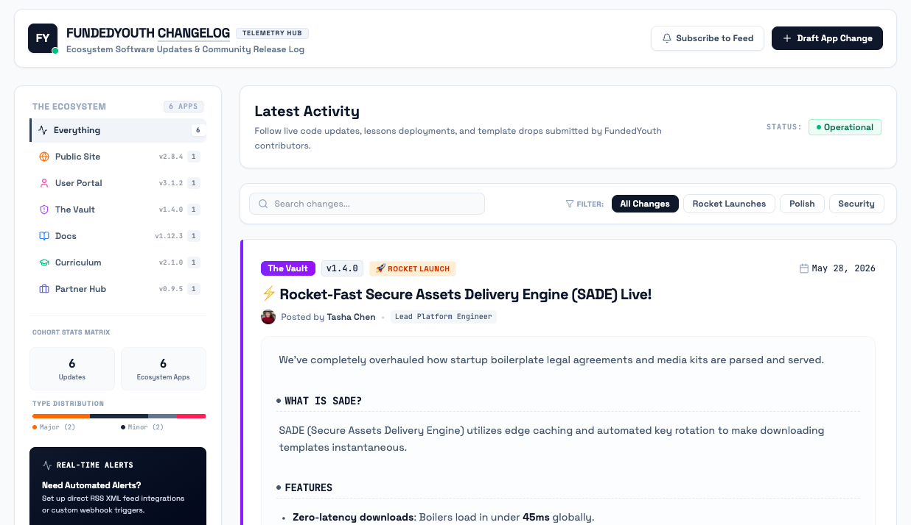

# FundedYouth Changelog Feed

A fun, interactive, high-energy changelog hub and subscription feed for the FundedYouth community to track updates across Public Site, User Portal, The Vault, Docs, and Curriculum.

## Run Locally

**Prerequisites:** Node.js

1. Install dependencies:
   `pnpm install`
2. Run the app:
   `pnpm dev`

## Managing Content

This is a fully static site — all updates are loaded from a single data file
(`public/data/changelog.json`), and the RSS / JSON feeds are generated from it.

See **[HowTo.md](./HowTo.md)** for a full guide on adding updates, managing apps,
writing markdown descriptions, regenerating the feeds, and deploying.
